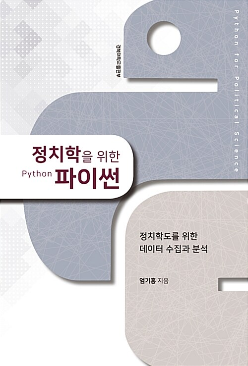

# 정치학을 위한 파이썬

`Python` `networkx` `matplotlib`

## 개요

이 저장소는 **정치학을 위한 파이썬**의 학습 내용을 정리하고 있습니다.

> 엄기홍

## 학습 목표
- 프로그래밍의 사회과학적 활용

## 학습 내용
|No|목차|핵심 학습 내용|
|---|---|---|
|01|정치학과 파이썬|정리 내용 없음|
|02|[파이썬 기본 문법](./02.ipynb)|· 패키지의 구조|
|03|[웹 스크랩핑을 통한 데이터 수집](./03.ipynb)|· BeautifulSoup|
|04|[API를 통한 데이터 수집](./04.ipynb)|· tweepy|
|05|[빅데이터 시각화와 분석](./05.ipynb)|· 한글 형태소 분석   · 네트워크 중심 측정 방식   · NetworkX's Layout|
